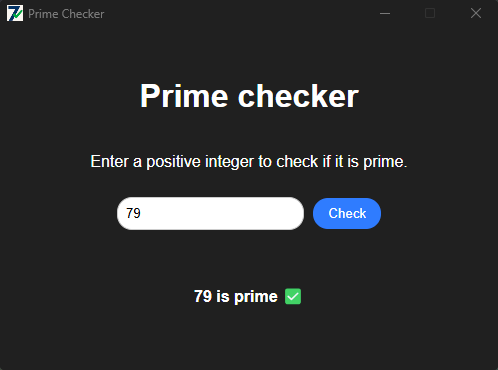

# Prime Checker

Prime Checker is a simple Tauri application designed to determine whether a given number is a prime number. Users can input a number through the graphical interface, and the application will display whether the number is prime or not.



## Features

- **Prime Number Check**: Enter a positive integer to check if it is a prime number.
- **Interactive UI**: A user-friendly interface built with HTML, CSS, and JavaScript.
- **Rust Backend**: The core logic for determining primality is implemented in Rust for performance and reliability.
- **Tauri Framework**: The application leverages the Tauri framework to bridge the frontend and backend seamlessly.

## Purpose

This project was created primarily for educational purposes. It includes detailed comments in both the Rust and JavaScript code to help developers understand the implementation and the interaction between the frontend and backend in a Tauri application.

## How It Works

1. The user enters a number in the input field and clicks the "Check" button.
2. The frontend sends the input to the Rust backend using Tauri's command system.
3. The Rust backend processes the input, checks if the number is prime, and returns the result.
4. The result is displayed in the user interface.

## Algorithm Explanation

The algorithm used in this project to determine whether a number is prime is an optimized primality test implemented in Rust. Below is a detailed explanation of its workings and the optimizations it employs:

### Base Cases

1. **Numbers ≤ 1**: These are not prime numbers by definition.
2. **Numbers 2 and 3**: These are prime numbers and are handled as special cases.

### Eliminating Multiples of 2 and 3

- Any number greater than 3 that is divisible by 2 or 3 is not a prime number. This step quickly eliminates a large set of non-prime numbers.

### Optimization: 6k ± 1 Rule

- All prime numbers greater than 3 can be expressed in the form `6k ± 1`, where `k` is an integer. This is because any integer can be expressed as `6k`, `6k ± 1`, `6k ± 2`, `6k ± 3`, or `6k ± 4`:
  - `6k` and `6k ± 2` are divisible by 2.
  - `6k ± 3` is divisible by 3.
  - Only `6k ± 1` remains as potential candidates for primality.

> This rule acts as a filter, much like a sieve used in gold prospecting. While the sieve does not retain only gold, it ensures that if gold is present, it will be caught. Similarly, the `6k ± 1` rule does not guarantee that all numbers it generates are prime, but it ensures that no prime numbers are omitted.

### Iterative Check up to √n

- To determine if a number `n` is prime, it is sufficient to check divisibility by numbers up to the square root of `n`. This is because if `n` has a divisor greater than its square root, the corresponding smaller divisor would have already been found.

- The algorithm starts checking divisors from 5 and increments by 6 in each step, testing numbers of the form `6k - 1` and `6k + 1`.

### Steps in the Algorithm

1. **Input Validation**: The input is parsed as an unsigned 64-bit integer (`u64`). If parsing fails, the input is considered invalid.
2. **Base Case Handling**: Numbers ≤ 1 are immediately rejected, and 2 and 3 are accepted as prime.
3. **Divisibility Check**: Numbers divisible by 2 or 3 are rejected.
4. **Iterative Check**:
   - Start from 5 and increment by 6 in each iteration.
   - Check divisibility by `i` (form `6k - 1`) and `i + 2` (form `6k + 1`).
   - Stop when `i` exceeds the square root of `n`.
5. **Result**: If no divisors are found, the number is prime.

### Optimisation

- **Reduced Divisor Checks**: By leveraging the `6k ± 1` rule, the algorithm skips many non-prime candidates, significantly reducing the number of checks.
- **Square Root Limit**: Limiting checks to √n ensures that the algorithm runs in O(√n) time complexity, which is efficient for most practical purposes.

## Prerequisites

To run this project, you need:

- [Rust](https://www.rust-lang.org/) installed on your system.
- [Node.js](https://nodejs.org/) installed for managing frontend dependencies.

## Getting Started

1. Clone the repository:
   ```bash
   git clone <repository-url>
   cd prime-checker
   ```

2. Install dependencies:
   ```bash
   npm install
   ```

3. Run the application in development mode:
   ```bash
   npm run tauri dev
   ```

4. Build the application for production:
   ```bash
   npm run tauri build
   ```

## File Structure

- **src/**: Contains the frontend code (HTML, CSS, JavaScript).
- **src-tauri/**: Contains the Rust backend code and Tauri configuration.

## License

This project is open-source and available under the [MIT License](LICENSE).

---

Feel free to explore the code and modify it to suit your needs. Contributions and feedback are welcome!

